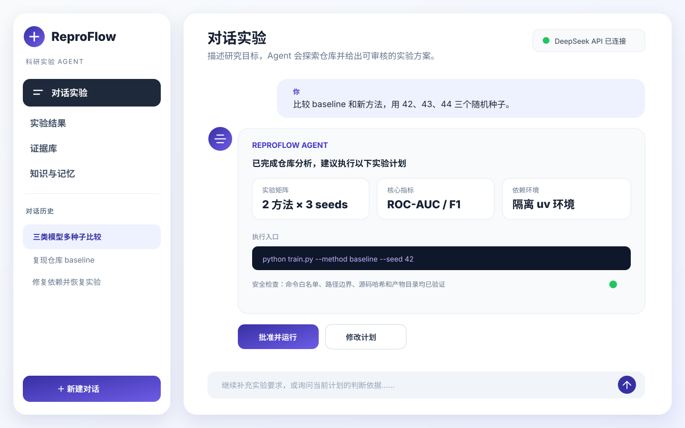

# ReproFlow Agent

[](https://github.com/Lalulala/ReproFlow-Agent/actions/workflows/ci.yml)
[](https://www.python.org/)
[](evals/latest_results.json)
[](LICENSE)

面向机器学习实验与论文证据管理的可复现 Agent 工作流系统。



> 当前里程碑：一周 MVP 与发布验收已完成。系统已走通“科研目标 → RAG/历史记忆 → 结构化计划 →
> 人工审批 → 安全实验 → 失败恢复 → 指标汇总 → Markdown 报告 → Evidence 提议 →
> 人工审批同步”的闭环，并提供仓库自动探索、受控代码生成、依赖隔离和 Repair Agent。

```text
对话目标 → 仓库探索/RAG/记忆 → 可审核计划与 Diff → Dependency Preflight
        → 人工批准 → LangGraph + shell-free Runner → 指标/报告/Evidence
        → 失败时生成新 Repair Plan → 再次审批
```

完整组件关系和信任边界见[架构文档](docs/architecture.md)。

## Agent 能力

### 规划、安全与人机协同

- Mock Planner 无需 API Key；API Planner 支持 DeepSeek 等 OpenAI-compatible 服务。
- Pydantic 校验结构化计划，同时保存机器可读 YAML 和中文书面计划。
- 内置 sklearn Planner 中，LLM 只能改写科研语义，不能改变已锁定的执行字段。
- 预检拦截 Shell 操作符、目录越界、非白名单命令、参数注入和历史结果覆盖。
- 计划未经人工审批不能执行，Evidence 未经人工审批不能同步。

### Repo-level Research Agent

- 用户只提供本地 Git 仓库路径和自然语言实验要求。
- Agent 自动忽略缓存、虚拟环境和敏感文件，识别 README、依赖、配置和候选训练/评测入口。
- API Agent 先选择需要深读的文件，再决定代码 Diff、执行命令、实验矩阵和指标解析。
- 代码与拟执行命令生成中文书面计划，人工批准前不写文件、不运行代码。
- 审批后只执行无 Shell 的 Python/pytest argv，拦截目录越界、内联 Python、危险导入、动态执行和删除调用。
- 执行前校验 Git commit、已阅读源文件哈希和 Diff 前置哈希，防止审核后代码漂移。
- Dependency Preflight 比对目标仓库声明依赖与当前版本；缺失、冲突或 Python 版本不同时，
  规划项目隔离的 uv 虚拟环境，并在审批计划中展示完整安装 argv。
- 失败后 Repair Agent 读取有长度上限的日志和相关源码，生成新的修复 Diff；原失败计划不被
  覆盖，修复代码、依赖和命令必须再次审批。
- 自动记录日志、解析 JSON/Regex 指标、汇总 CSV、生成中文报告、记忆和待审核 Evidence。

### 执行、恢复与可观测性

- LangGraph 编排执行、解析、汇总、分析、报告和证据提议节点。
- SQLite checkpoint 支持中断恢复；成功任务保持幂等，只重试失败或未完成任务。
- 异步、无 Shell 的 subprocess Runner，支持 timeout、取消、退出码和日志大小限制。
- 保存运行状态、Agent Trace、Git commit、配置哈希、脚本哈希及环境快照。

### Day 5：记忆、RAG 与上下文工程

- 工作记忆：LangGraph State 和 SQLite checkpoint。
- 情景记忆：自动沉淀实验摘要、失败历史和 dataset-specific lessons。
- RAG：索引本地 Markdown、TXT、PDF、论文证据文件和历史 `report.md`。
- Lexical 模式完全离线；Chroma 使用本地 `all-MiniLM-L6-v2` embedding。
- 检索结果包含来源路径、章节/页码、标签、分数和内容 SHA256。
- Planner 可读取知识与历史实验；Runner 只接收批准计划；Reporter 只接收验证数据。
- 无本地证据时明确返回 `No evidence found`。

### Day 6：报告、Evidence Registry 与 UI

- Jinja2 生成可复现 `report.md`，所有数字来自已验证的 CSV 和 `metrics.json`。
- Mock Narrator 可离线说明结果、局限和下一步；API Narrator 不允许生成数字。
- 自动建立 Claim—Experiment—Artifact 关系。
- Evidence 先进入 `proposed`，审核后成为
  `supported / contradicted / inconclusive`。
- 支持根据 Git commit 或配置哈希变化标记 `stale`。
- 只同步 `paper/evidence_registry.jsonl` 和 `paper/generated_results.md`，不改论文手稿。
- Streamlit 保留“对话实验、实验结果、证据库、知识与记忆”四个入口；标准工作流和
  仓库 Agent 作为对话 Agent 的底层能力，不再暴露为独立页面。

核心实验循环参考 Andrej Karpathy 的
[autoresearch](https://github.com/karpathy/autoresearch)。ReproFlow 将其扩展为带审批、记忆、
RAG、checkpoint 和论文证据溯源的科研 Agent，不复制 nanochat 训练实现。

## 安装

```bash
uv python install 3.12
uv sync --extra dev
```

要求 Python 3.12，支持 macOS、Linux 和 Windows CPU。

最快体验方式：

```bash
uv run reproflow ui --project .
```

## 完整运行

创建计划：

```bash
uv run reproflow init .

REPROFLOW_RAG_BACKEND=lexical uv run reproflow plan \
  --goal "比较三类模型在三个随机种子下的效果" \
  --planner mock
```

查看 Planner 使用的最小 ContextPack：

```bash
REPROFLOW_RAG_BACKEND=lexical uv run reproflow context-show \
  --stage planner \
  --task "比较三类模型在三个随机种子下的效果"
```

生成计划后，可直接打开可见目录下的中文书面版：

```text
plans/<plan_id>.md
```

检查并人工审批：

```bash
uv run reproflow plan-show <plan_id>
uv run reproflow preflight <plan_id>
uv run reproflow approve <plan_id> \
  --actor Ethan \
  --reason "已核对实验矩阵、命令和输出路径"
```

`plan-show` 默认显示中文书面计划。仅在调试时使用
`reproflow plan-show <plan_id> --raw` 查看机器可读 YAML。

执行批准计划：

```bash
uv run reproflow run <plan_id>
```

运行结束会自动生成 CSV、图表、实验记忆、Markdown 报告和待审批 Evidence。查看状态：

```bash
uv run reproflow workflow-show <plan_id>
uv run reproflow memories
uv run reproflow evidence list
```

当前实现使用 `plan_id` 作为 `workflow_id`，保证同一批准计划不会覆盖历史结果。

## 接入任意本地实验仓库

先进行完全只读的仓库探索：

```bash
uv run reproflow repo inspect /path/to/repository \
  --goal "复现仓库主实验，比较 baseline 与新方法的三个随机种子"
```

加载 DeepSeek 环境变量后，让 Repo Agent 自主阅读代码并生成计划：

```bash
set -a
source .env
set +a

uv run reproflow repo plan /path/to/repository \
  --goal "复现仓库主实验，比较 baseline 与新方法的三个随机种子" \
  --agent api
```

Agent 会输出 `repo_plans/<repo_plan_id>.md`，其中包含已阅读文件、判断理由、
完整代码 Diff、Dependency Preflight、隔离环境安装 argv、每条拟执行命令、随机种子、
超时和指标来源。审核后执行：

```bash
uv run reproflow repo show <repo_plan_id>
uv run reproflow repo dependencies <repo_plan_id>
uv run reproflow repo approve <repo_plan_id> --actor Ethan
uv run reproflow repo run <repo_plan_id>
```

部分失败时，成功运行保持幂等，只重试失败项：

```bash
uv run reproflow repo resume <repo_plan_id>
```

如果运行或隔离环境安装失败，让 Repair Agent 基于日志生成一个新的待审批计划：

```bash
uv run reproflow repo repair <failed_repo_plan_id> \
  --feedback "优先保持原实验矩阵，修复依赖和运行错误"

uv run reproflow repo show <new_repair_plan_id>
uv run reproflow repo approve <new_repair_plan_id> --actor Ethan
uv run reproflow repo run <new_repair_plan_id>
```

修复最多三轮。每轮都有独立计划编号、Diff、运行目录和审批记录。

API 模式会向配置的 OpenAI-compatible 服务发送经过筛选和脱敏的代码片段。
`.env`、凭据、私钥、二进制文件、数据集、缓存和虚拟环境不进入模型上下文。
Mock 模式仅能识别内置 sklearn Demo；对未知仓库会安全降级为运行现有 pytest。

## RAG

可靠的离线索引：

```bash
uv run reproflow knowledge index --backend lexical
uv run reproflow knowledge search "ROC-AUC protocol" --backend lexical
```

本地向量索引：

```bash
uv run reproflow knowledge index --backend chroma
uv run reproflow knowledge search "Which model performed best?" --backend chroma
```

Chroma 第一次运行会下载约 79 MB 的本地 MiniLM 模型。文档在本机完成 embedding，
向量数据库位于 `knowledge/.chroma/`。在向量索引尚未建立时，`auto` 自动使用 lexical，
避免规划命令意外触发模型下载。

## 报告

工作流默认使用 Mock Narrator 自动生成：

```text
runs/<workflow_id>/report.md
```

也可以在已加载 OpenAI-compatible 环境变量后重新生成 API 说明：

```bash
set -a
source .env
set +a

uv run reproflow report <workflow_id> --narrator api
```

API Reporter 会把已验证的 summary 和 aggregate 发送给所配置的模型服务。它被要求不输出
任何数字；若响应中出现数字，系统自动回退至 Mock Narrator。实验数值始终由模板直接读取。

## Evidence 审批与论文同步

查看 Claim 与完整溯源：

```bash
uv run reproflow evidence list
uv run reproflow evidence show <claim_id>
```

`evidence list` 和 `evidence show` 默认显示中文书面解释，包括一句话结论、
指标对比、理解边界和复现信息。调试时可使用
`reproflow evidence show <claim_id> --raw` 查看原始 Schema。

人工审核后批准：

```bash
uv run reproflow evidence approve <claim_id> --actor Ethan
```

只有存在已审核 Evidence 时才能同步：

```bash
uv run reproflow evidence sync
```

同步范围严格限制为：

```text
paper/evidence_registry.jsonl
paper/generated_results.md
```

检测代码或计划配置变化：

```bash
uv run reproflow evidence audit-stale <claim_id> --plan-id <plan_id>
```

## 失败与恢复

```bash
uv run reproflow run <plan_id> \
  --simulate-failure svm:43 \
  --simulate-timeout random_forest:44 \
  --timeout-seconds 1

uv run reproflow resume <plan_id>
```

`resume` 默认清除演示故障，并只重试失败任务。使用 `--crash-after 2` 可演示一次性
进程中断；执行期间按 Control+C 会记录 `cancelled`。

## Streamlit UI

```bash
uv run reproflow ui
```

- 对话实验：用中文提出或补充实验要求，在聊天中查看计划与 Diff，并通过按钮审批、执行和恢复。
  点击“新建对话”只打开临时会话，不会产生空白历史项；第一次问答完成后自动根据用户目标命名，
  再把对话及其关联计划保存到项目 SQLite，重新打开 UI 后可从左侧历史列表继续。

标准工作流和仓库执行的底层实现仍然保留，由对话 Agent 在需要时调用；对应 CLI 也保持兼容。

- 实验结果：先选择可读的实验名称，再查看该实验的运行、聚合指标、图表、报告和失败信息。
- 证据库：先选择实验，只显示该实验产生的 Claim；Evidence 审批仍需人工确认。
- 知识与记忆：可选择“全部项目”或某次实验；实验范围只显示该实验报告、经验和失败记忆。

侧栏仅展示产品导航、当前页面说明和对话历史，不显示本机项目绝对路径；仓库路径只在
“实验设置”中按需编辑。代码、依赖修复与 Evidence 审批仍保持显式人工确认。

## 输出结构

```text
plans/
└── <plan_id>.md              # 中文书面实验计划
repo_plans/
└── <repo_plan_id>.md         # Agent 的仓库阅读、Diff 与命令决策
runs/<workflow_id>/
├── <variant>-seed-<seed>/
│   ├── artifacts/
│   ├── plan_snapshot.yaml
│   ├── environment.json
│   ├── stdout.log
│   ├── stderr.log
│   ├── metrics.json
│   ├── manifest.json
│   └── attempts.jsonl
├── summary.csv
├── aggregate.csv
├── failures.csv
├── report.md
└── plots/metrics.png
paper/
├── evidence_registry.jsonl  # 机器可读证据库
└── generated_results.md     # 中文书面证据摘要
```

## 测试与验收

```bash
uv run ruff check src tests scripts
REPROFLOW_RAG_BACKEND=lexical uv run pytest tests \
  --cov=reproflow --cov-fail-under=80 -q
uv run reproflow eval --project . --minimum-passes 18
```

当前 50 条自动化测试全部通过，核心代码覆盖率 85.84%；20 条 Agent eval 通过 20/20。评测覆盖安全规划、
命令护栏、RAG 命中和指标一致性，机器可读结果见
[`evals/latest_results.json`](evals/latest_results.json)。已验证：

- 第二次规划会引用第一次实验的 report、experiment memory 和 lesson。
- Chroma + 本地 MiniLM 实际索引 16 个知识块，并正确检索历史最佳模型。
- 9/9 成功工作流在恢复时跳过全部实验，只补生成记忆、报告和 Evidence。
- 报告中的数字和来源路径可回溯到 CSV、metrics 与 manifest。
- 未审批 Evidence 无法写入正式 Registry。
- 配置哈希变化后 Evidence 可标记 stale。
- Streamlit 保留四个条形入口；结果、证据和记忆均可按实验筛选，对话历史可跨 Store 恢复。
- Repo Agent 能从仓库自动选择现有实验入口并运行 9/9 对比实验。
- Repo Agent 生成的新 Python 文件在审批前不会落盘，执行后指标可正确解析与汇总。
- 实验命令仍拒绝依赖安装模块、绝对路径和 `..` 越界参数；只有审批计划中列出的隔离环境
  requirements 可由环境准备器安装。
- Dependency Preflight、真实 uv 虚拟环境创建，以及“真实失败 → Repair Plan → 二次审批 →
  修复成功”的端到端测试均通过。

此外已使用 micrograd、homemade-machine-learning、ML-From-Scratch 三个公开仓库进行真实
API 规划与受控运行；成功、失败原因和修复记录见
[`evals/repository_compatibility.md`](evals/repository_compatibility.md)。

## 演示与发布材料

- 产品界面预览：[`docs/assets/ui-overview.svg`](docs/assets/ui-overview.svg)
- 两分钟演示讲稿：[`scripts/demo_2min.md`](scripts/demo_2min.md)
- 架构与信任边界：[`docs/architecture.md`](docs/architecture.md)
- 多仓库兼容性矩阵：[`evals/repository_compatibility.md`](evals/repository_compatibility.md)
- 安全策略：[`SECURITY.md`](SECURITY.md)
- 贡献与本地验收：[`CONTRIBUTING.md`](CONTRIBUTING.md)
- 版本记录：[`CHANGELOG.md`](CHANGELOG.md)

## 后续路线图

- 增加更多真实科研仓库 adapter 与 GPU 调度后端。
- 为 API Planner 增加独立的语义质量评测集和成本/延迟统计。
- 将实验级 RAG 元数据下沉为向量库原生过滤条件。

## 许可证

MIT。见 [LICENSE](LICENSE)。
