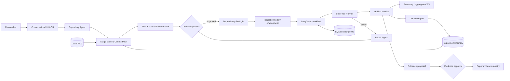

# ReproFlow Architecture

## Trust boundaries

| Boundary | Input | Control | Output |
| --- | --- | --- | --- |
| Repository context | Local source and documentation | Ignore rules, size limits, secret filtering | Bounded manifest and excerpts |
| Planner | Goal and ContextPack | Pydantic schema, locked executable fields | Reviewable plan and diff |
| Dependency setup | Requirement files | Normalization, explicit argv, project uv environment | Isolated interpreter |
| Runner | Approved argv | `shell=False`, allowlist, path containment, timeout | Logs, metrics, manifests |
| Reporter | Verified CSV and metrics | No unverified numerical generation | Traceable report |
| Evidence sync | Proposed claims | Human approval and staleness audit | Two paper evidence files |

## Persistent data

- `.reproflow/reproflow.db`: plans, workflows, runs, traces, memories, evidence, and chat history.
- `.reproflow/checkpoints.sqlite`: LangGraph recovery checkpoints.
- `runs/<workflow_id>/`: immutable run logs, metrics, manifests, summaries, plots, and reports.
- `paper/`: approved evidence registry and generated results summary only.
